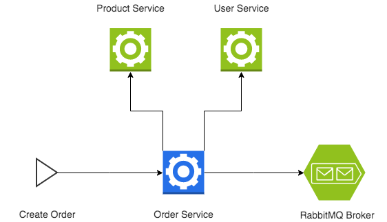

## Goal

Nowadays, the Microservice Architecture Pattern has been widely used. However, it has several drawbacks and it can be challenging to implement it.

The goal of this test is to assess (to some degree) your coding and architectural skills building robust and reliable systems.

You're given a problem so you can focus on showcasing development techniques.

The image below presents a diagram that describes the problem.

<p align="center">
  
</p>

## Prerequisites

- [docker](https://www.docker.com/)
- [docker-compose](https://docs.docker.com/compose/)


## Requirements

In this test, you need to implement one microservice:

- [Order Service Requirements](docs/order-service.md)


These are some aspects you should pay particular attention to:
- You MAY use any framework and ORM you prefer.
- Your application MUST run within the containers. Please provide short setup instructions.


## Use Cases
Both [Product Service](docs/product-service.md) and [User Service](docs/user-service.md) have some faulty behavior for specific products and users. When testing the use cases below, be aware of them.

#### Create Order #1
```json
{
    "user_id": "7c11e1ce2741",
    "product_code": "classic-box"
}
```

#### Create Order #2
```json
{
    "user_id": "7c11e1ce2741",
    "product_code": "family-box"
}
```

#### Create Order #3
```json
{
    "user_id": "7c11e1ce2741",
    "product_code": "veggie-box"
}
```

#### Create Order #4
```json
{
    "user_id": "e6f24d7d1c7e",
    "product_code": "classic-box"
}
```

#### Create Order #5
```json
{
    "user_id": "e6f24d7d1c7e",
    "product_code": "family-box"
}
```

#### Create Order #6
```json
{
    "user_id": "e6f24d7d1c7e",
    "product_code": "veggie-box"
}
```

### To run the application

1. Clone the repo
2. cd ${repo_name}
3. docker-compose build
4. docker-compose run -d
5. Navigate to localhost:80
